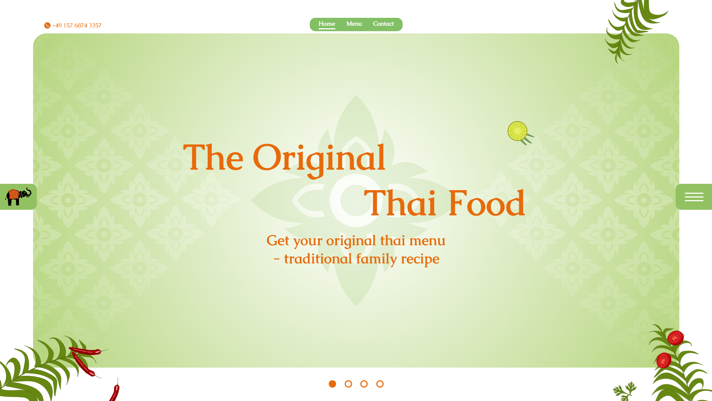
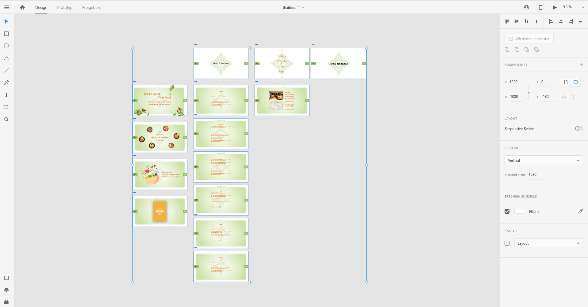

# 📄 Table of Contents

- [Introduction](#introduction)
- [Set up](#setup)
- [Ambition](#ambition)
- [Design](#design)
- [License](#license)

</br>
</br>
</br>

<div align="center" name="introduction">
  
</div>
<h1 align="center">
 <a href="https://thai-food-live.herokuapp.com/">thai-food-live.herokuapp.com - v1</a>
</h1>
<p align="center">
A reinventing of an existing website built with React - Redux - Styled Components - React Router Dom and hosted with <a href="https://heroku.com/" target="_blank">Heroku</a>
</p>
<div align="center">
  
</div>

</br>

## <div name="setup"> 🛠 Set Up </div>

1. Install React ^16.13.1
2. Install React-Dom ^16.13.1
3. Install React-Redux ^7.2.0
4. Install Redux ^4.0.5
5. Install Redux-Logger ^3.0.6
6. Install React-ID-Generator ^3.0.0
7. Install React-Router-Dom ^5.1.2
8. Install Styled-Components ^5.1.0
9. Install Reselect ^4.0.0
10. Intall React-aria-live ^2.0.5
11. Install lodash.chunk ^4.2.0
12. Install lodash.debounce ^4.14.0

```bash
npm install lodash.chunk lodash.debounce react-router-dom reselect react-aria-live styled-components react-id-generator redux-logger redux
```

</br>

## <div name="ambition"> 🔥 Ambition </div>

<p align="center">
"Practice makes perfect. After a long time of practicing, our work will become natrual, skillfull, swift, and steady. - Bruce Lee"
</p>

</br>

<p>
This Project is about animations, transitions and accessibility. 15% of the population has some form of disability, so with that in mind, I used react-aria-live to ensure everything is accessible as possible. The ambition of this project was not only to create a website with fancy animations with a library, but to create my own simple animations and managing them. 
</p>

</br>

<p>
I copied from the target website a part of the menu and created my own dataset. Thus, I programmed a scalable menu website. Which is also responsiv and supports rotation.

I tested the website with chrome vox and to ensure also a pleasing expierince for people with disabilities!

</p>
  
</br>

## <div name="design"> 🔱 Design </div>

<p>The design was about establishing an thai ambience. Colors were chosen by restaurante logo and a adjusted a little bit to thailands color platte. Also the font supports the tropic enviroment. I started with a moodboard in adobe xd and structured a visuale plan for me. Created the background, recreated the logo,searched for fitting svgs.

I worked with AI to adjust the svgs for my purpose. Also created the background myself, which represents the lotus in the top down view. The big lotus svg a accompanies through out the whole website, to ensure a perfectly clean and beautiful view.</p>

| Color        | Hex                                                                |
| ------------ | ------------------------------------------------------------------ |
| Green        |  `#B4D47B` |
| Brown        |  `#82BF65` |
| Light Orange |  `#FFCF96` |
| Orange       |  `#F2B13E` |
| Dark Orange  |  `#E76A0B` |

<div align="center">
  
</div>

## <div name="license"> ⚖️ License </div>

Copyright (c) [2020][berkay yurdagül]

Permission is hereby granted, free of charge, to any person obtaining a copy of this software and associated documentation files (the "Software"), to deal in the Software without restriction, including without limitation the rights to use, copy, modify, merge, publish, distribute, sublicense, and/or sell copies of the Software, and to permit persons to whom the Software is furnished to do so, subject to the following conditions:

The above copyright notice and this permission notice shall be included in all copies or substantial portions of the Software.

THE SOFTWARE IS PROVIDED "AS IS", WITHOUT WARRANTY OF ANY KIND, EXPRESS OR IMPLIED, INCLUDING BUT NOT LIMITED TO THE WARRANTIES OF MERCHANTABILITY, FITNESS FOR A PARTICULAR PURPOSE AND NONINFRINGEMENT. IN NO EVENT SHALL THE AUTHORS OR COPYRIGHT HOLDERS BE LIABLE FOR ANY CLAIM, DAMAGES OR OTHER LIABILITY, WHETHER IN AN ACTION OF CONTRACT, TORT OR OTHERWISE, ARISING FROM, OUT OF OR IN CONNECTION WITH THE SOFTWARE OR THE USE OR OTHER DEALINGS IN THE SOFTWARE.
